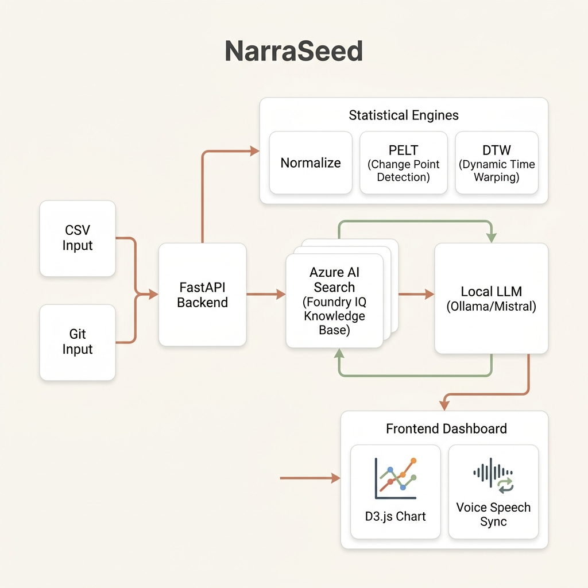

# NarraSeed System Architecture

## System Overview

**NarraSeed** is a temporal narrative intelligence platform that ingests, cleans, analyzes, and contextualizes time-series data into narrative-driven stories. It is designed as a hybrid statistical/AI pipeline where raw data is parsed and segmented using deterministic mathematical algorithms before being summarized and structured by a Large Language Model.

The system relies on a local-first philosophy using **Ollama** for LLM execution (preventing latency, pricing, and quota barriers) coupled with **Microsoft Azure AI Search (Foundry IQ)** for retrieval-augmented generation (preventing hallucinations by grounding narratives in strict structural guidelines).

---

## System Architecture Diagram

Below is the conceptual architecture showing data routing from ingestion to visualization:



---

## The 6-Stage Temporal Narrative Pipeline

The backend API executes a structured 6-stage processing pipeline on every input CSV:

```
┌──────────┐     ┌──────────┐     ┌──────────┐     ┌──────────┐     ┌──────────┐     ┌──────────┐
│  Stage 1 │ ──> │  Stage 2 │ ──> │  Stage 3 │ ──> │  Stage 4 │ ──> │  Stage 5 │ ──> │  Stage 6 │
│  Ingest  │     │   PELT   │     │   DTW    │     │Foundry IQ│     │  Ollama  │     │ Render & │
│& Sort CSV│     │Turning Pt│     │Arc Match │     │Grounding │     │Mistral-7B│     │ Voice    │
└──────────┘     └──────────┘     └──────────┘     └──────────┘     └──────────┘     └──────────┘
```

### 1. Ingest, Filter & Normalize
- **Robust Ingestion**: Loads the uploaded CSV file. Detects numeric columns, dates, and categorical columns.
- **Categorical Filtering**: If the dataset contains an entity grouping column (such as `Entity` or `Country`), the system dynamically filters the dataset to focus on a single entity sequence (defaulting to the first grouping that contains at least 5 records, e.g. `Afghanistan` in the UN population projections dataset).
- **Chronological Sorting**: Parses date fields as timestamps and sorts records chronologically.
- **Min-Max Normalization**: Projects the target values onto a `[0.0, 1.0]` scale. This allows the system to compare differently scaled datasets (like GPA [0-4] and population in millions) using uniform pattern matching.
- **Interpolation**: Interpolates any missing entries (NaN values) using linear interpolation.

### 2. Regime Segmentation (PELT)
- Uses the **Pruned Exact Linear Time (PELT)** algorithm (via the `ruptures` package) with a Least Squares (L2) cost model.
- Automatically isolates major structural changes (turning points) in the normalized dataset.
- Classifies each transition as `growth` (↑), `decline` (↓), or `transition` (↔) depending on value shifts.

### 3. Pattern Classification (Dynamic Time Warping)
- Computes similarity distances between the normalized time-series segment and 6 predefined narrative curve templates:
  - **Rags to Riches**: Constant progressive rise (0 to 1).
  - **Tragedy**: Constant progressive fall (1 to 0).
  - **Icarus**: Steep rise followed by a rapid crash.
  - **Man in a Hole**: Initial drop followed by recovery.
  - **Phoenix**: Severe drop to zero followed by an extraordinary rise/reinvention.
  - **Oedipus**: Shallow dip followed by an insightful ascent.
- Uses **Dynamic Time Warping (DTW)** with Euclidean distance to calculate pattern similarity, choosing the arc with the highest normalized confidence score.

### 4. Knowledge Grounding (Foundry IQ)
- Queries the Azure AI Search `narrative-templates` index using the matched arc name.
- Retrieves verified guidelines, writing tones, opening hooks, and structural outlines from the knowledge index.
- If Azure Search is unreachable or unconfigured, the system automatically falls back to a locally cached dictionary of template rules.

### 5. Grounded Narrative Generation (Ollama LLM)
- Builds a highly structured prompt combining:
  - The retrieved structural guidelines and templates from **Foundry IQ**.
  - The chronological data values (acting as factual anchors).
  - A customizable tone/style parameter (`dramatic`, `factual`, `poetic`).
- Sends the prompt to a local **Ollama** service running **Mistral-7B**.
- **Connection Fallback**: Uses a fast 3-second connection timeout. If Ollama is offline or slow to connect, it immediately falls back to compiling a rule-based story using the retrieved templates, avoiding system hangs.
- Emits citations mapping each story segment to corresponding source indices, raw values, and template documents.

### 6. Interactive Visualization & Delivery
- **D3.js Vector Timeline**: Renders a beautiful SVG line chart. It features dynamic date formatting on X-axis ticks, interactive data point nodes, glowing turning point circles, and interactive tooltips displaying original unscaled values.
- **Narration Sync**: Uses the HTML5 **Web Speech API** to synthesize audio speech. Tracks boundaries to highlight active spoken words with smooth CSS animations.

---

## Microsoft IQ Integration: Foundry IQ

NarraSeed utilizes Azure AI Search as a Knowledge Base for narrative patterns. Rather than letting the LLM hallucinate narrative styles, Foundry IQ serves as an anchor. The templates inside the knowledge index act as constraints:

```python
search_client = SearchClient(endpoint=env["endpoint"], index_name=env["index"], credential=AzureKeyCredential(env["key"]))
results = search_client.search(f"arc_name:\"{arc_name}\"", query_type=QueryType.FULL)
```

By retrieving specific templates (e.g. guidelines on highlighting resilience for "Man in a Hole" vs cautions on hubris for "Icarus"), the LLM generates narratives that are contextually accurate and consistent with structural design.

---

## GitHub Copilot MCP Server

The project contains a standard Model Context Protocol (MCP) server under `backend/mcp/mcp_server.py`. Using the `fastmcp` SDK, it exposes:

1. `analyze_timeseries(file_path: str, style: str = "dramatic")`: Executes the full 6-stage pipeline on a local CSV and outputs the complete JSON narrative.
2. `remix_git_history(repo_path: str = ".")`: Parses local git history, aggregates commit frequencies, runs the pipeline, and generates a "Developer's Journey" story about coding progress.

This allows developers to chat with GitHub Copilot in VS Code and get stories about their codebase or project metrics.

---

## Tech Stack Rationale

| Tool | Purpose | Advantage |
|---|---|---|
| **FastAPI** | REST API | Extremely low overhead, async/await native, automatic Swagger/OpenAPI spec generation. |
| **Ollama (Mistral)** | Local LLM | No network latency, no subscription/billing, secure offline data processing. |
| **Azure AI Search** | Knowledge Grounding | High-performance full-text search, Microsoft ecosystem alignment, structured citation tracking. |
| **D3.js** | Visual Chart | Crisp SVG rendering, high flexibility for custom annotations, zooming/panning support. |
| **Web Speech API** | Narration | Built-in browser support, zero API charges, provides event handlers for word-boundary highlights. |
